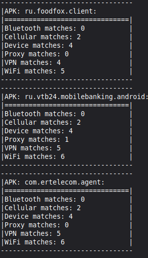
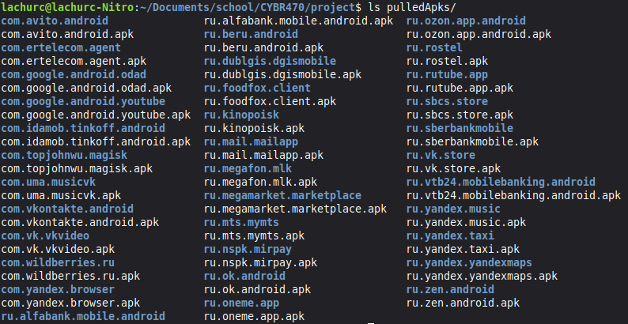
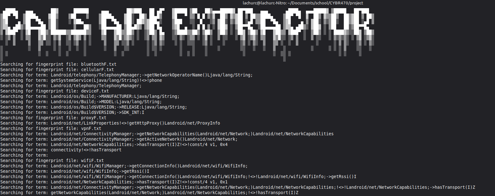
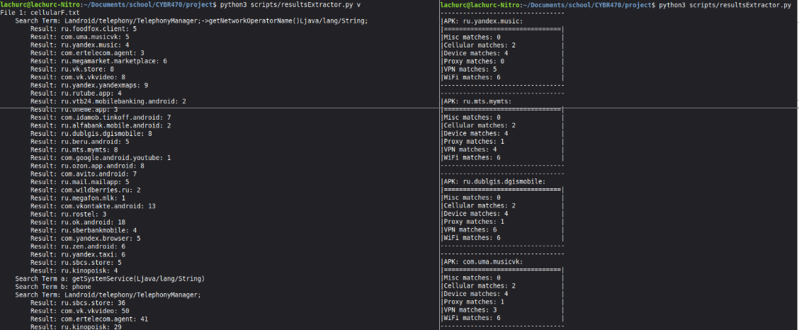
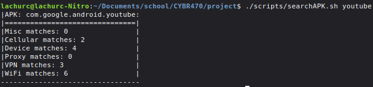

# CYBR470 - Reverse Engineering project

This project is based upon the research done upon russian apps and their surviellance of VPNs in particular and many other categories like getting GPS and device information. This is an unfinished project but the apps built in this project may be used to further research into any android application. Below are the links to the preceding research and knowledge that was used to build this project:

[Github Link](https://github.com/net4people/bbs/issues/605)
[PDF Link](https://files.rks.global/russian_apps_search_for_vpn_en.pdf)

## Initial Analysis

The initial analysis phase of this project consisted of using my script to extract the APKs from the android device with `adb` and `apktool` to decompile the APKs. I also used `jadx` to decompile the APKs into java code to be able to read through the code and find the terms that I wanted to search for in the next phase of this project. The main APK that was searched was the VTB online app `ru.vtb24.mobilebanking.android`, I followed the rabbit trail down this app and found where all of the information was being serialized as well as where all of the information from the device was being harvested at, this is where I found the terms that I wanted to search for in the fingerprinting portion of this project.

## What I built

The first main component of this project was a custom script to automate collecting all of the non pre-installed apps on the android device and extracting the APKs to the machine running the script, this will then use `apktool` to decompile the APKs.

The second main component of this project was a custom script to automate searching through the use of `ripgrep` for certain terms found in the analysis phase of this project. This script will use a combination of python and bash to authomate the searching process and parsing of the information found in the search. The method in which all of this is done is not perfect and this could definitely be done more efficiently but it works. 

The application will then output all of the information found into a readable format. 

## Results found:

Below is a quick summary of the results found in the 34 APKs that were searched (this does not account for the number of matches found, just the number of APKs that had at least 1 match for each category):

- **VPN matches:** 33/34
- **Cellular matches:** 32/34
- **WiFi matches:** 32/34
- **Device matches:** 34/34
- **Proxy matches:** 15/34
- **Misc matches:** 2/34



## Apps that were searched

|App name | APK name | How | 
|---------|----------| --------|
|T-Bank | com.idamob.tinkoff.android|  Fingerprint |
|VK video | com.vk.vkvideo | Fingerprint |
|Alfa-Bank | ru.alfabank.mobile.android | Fingerprint |
|Yandex Market | ru.beru.android | Fingerprint |
|Odnoklassniki | ru.ok.android | Fingerprint |
|Yandex Eda | ru.foodfox.client | Fingerprint |
|MegaMarket | ru.megamarket.marketplace | Fingerprint |
|Avito | com.avito.android | Fingerprint |
|Yandex Browser | com.yandex.browser | Fingerprint |
|VKontakte | com.vkontakte.android | Fingerprint |
|VTB Online | ru.vtb24.mobilebanking.android | Manually |
|RuStore | ru.vk.store | Fingerprint |
|2GIS | ru.dublgis.dgismobile | Fingerprint |
|Dzen | ru.zen.android | Fingerprint |
|My MTS | ru.mts.mymts | Fingerprint |
|Mail.ru Mail | ru.mail.mailapp | Fingerprint |
|Yandex Go | ru.yandex.taxi | Fingerprint |
|MAX / TamTam | ru.oneme.app | Fingerprint |
|Ozon | ru.ozon.app.android | Fingerprint |
|Kinopoisk | ru.kinopoisk | Fingerprint |
|MegaFon | ru.megafon.mlk | Fingerprint |
|Yandex Music | ru.yandex.music | Fingerprint |
|Gosuslugi | ru.rostel | Fingerprint |
|Mir Pay | ru.nspk.mirpay | Fingerprint |
|Samokat | ru.sbcs.store | Fingerprint |
|Wildberries | com.wildberries.ru | Fingerprint |
|Yandex Maps | ru.yandex.yandexmaps | Fingerprint |
|Rutube | ru.rutube.app | Fingerprint |
|VK Music | com.uma.musicvk | Fingerprint |
|Sberbank Online | ru.sberbankmobile | Fingerprint |
|Мой Дом.ру | com.ertelecom.agent | Fingerprint |
|Systempackage | com.google.android.odad | Fingerprint |
|YouTube | com.google.android.youtube | Fingerprint |
|Magisk | com.topjohnwu.magisk | Fingerprint |

## Tools used

- Linux 6.14.0-37-generic
- Python 3.12.3
- Bash 5.2.21
- Jadx-1.5.5 [Github link](https://github.com/skylot/jadx)
- apktool_3.0.2.jar [Github link](https://github.com/ibotpeaches/apktool)
- ripgrep 14.1.0 [Installation Steps](https://github.com/BurntSushi/ripgrep/blob/master/README.md#installation)

## How to run 

### Cloning the repository

```bash
git clone git@github.com:calruch/RE_RU_Android_Applications.git
cd RE_RU_Android_Applications
```
### Getting the APKs

```bash
./scripts/extractAPKs.sh
```



#### Auto term search

If you are wanting to remove all of the fingerprint terms from the fingerprint text files and add your own, just use your text editor to remove all of the terms from the text files in the `fingerprint/` directory.

```bash
./scripts/autoTS.sh
./scripts/autoTS.sh v
```


#### Add terms to the fingerprint search

```bash
./scripts/termAdder.sh
```

#### Get results after running the auto term search script

```bash
python3 scripts/resultsExtractor.py
python3 scripts/resultsExtractor.py v
```



#### If you are looking for a specific term in the results, use the searchAPK script or a chain grep command

```bash
./scripts/searchAPK.py
./scripts/searchAPK.py | grep -A 8 "searchterm" 
```


## Future work 

- If I had more time to work on this project for this class, I would have liked to develop a more efficient searching method, what I built work but it was not the most effient way to do it. 

- I would like to be able to create a machine learning model to be able classify the apps based on what fingerprint terms they are found with. 

- I would like to have increased the sample size of the apps that I am working with, I had limited time and chose to only work with the 30 apps that were mentioned in the paper.

- Perform a dynamic analysis using a proxy to be able to see what information is being sent out from the device and to where it is being sent.
